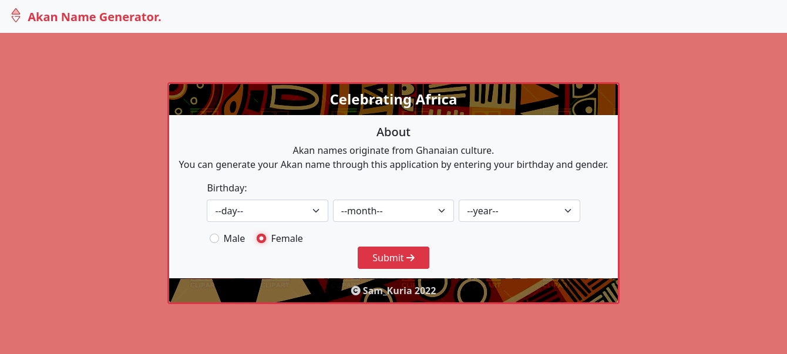

# Akan_Name_Generator

## Table of Content

- [Description](#description)
- [Technology Used](#technology-used)
- [Reference](#reference)
- [Licence](#licence)
- [Authors Info](#author-Info)

## Description

This is a web application that generates Akan Names from Ghanian Culture.

### Screenshot

### Install Requirements

- Computer.

- Internet Access.

- git.

- Terminal.

### Installation

- On your computer open terminal and run:  
  `git clone https://github.com/qurriahSam/akanNameGenerator.git`

[Go Back to the top](#Akan_Name_Generator)

## Technology

- Semantic HTML5 Markup - Has been used to build the structure of the page.

- CSS Custom properties - Has been used to style the landing page.

- JavaScript - Has been used to create the business logic.

- Bootstrap - Has been used for styling the navbar and other elements on the landingpage.

### Links

- Live Site URL: [Akan-Name-Generator](https://qurriahsam.github.io/akanNameGenerator/)

[Go Back to the top](#Akan_Name_Generator)

## License

[MIT](./LICENSE) License.

[Go Back to the top](#Akan_Name_Generator)

## Authors Info

Linked - [Sam Kuria](https://www.linkedin.com/in/sam-kuria-0904b01a1)

[Go Back to the top](#Akan_Name_Generator)
